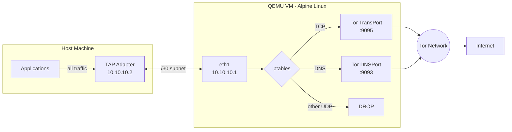
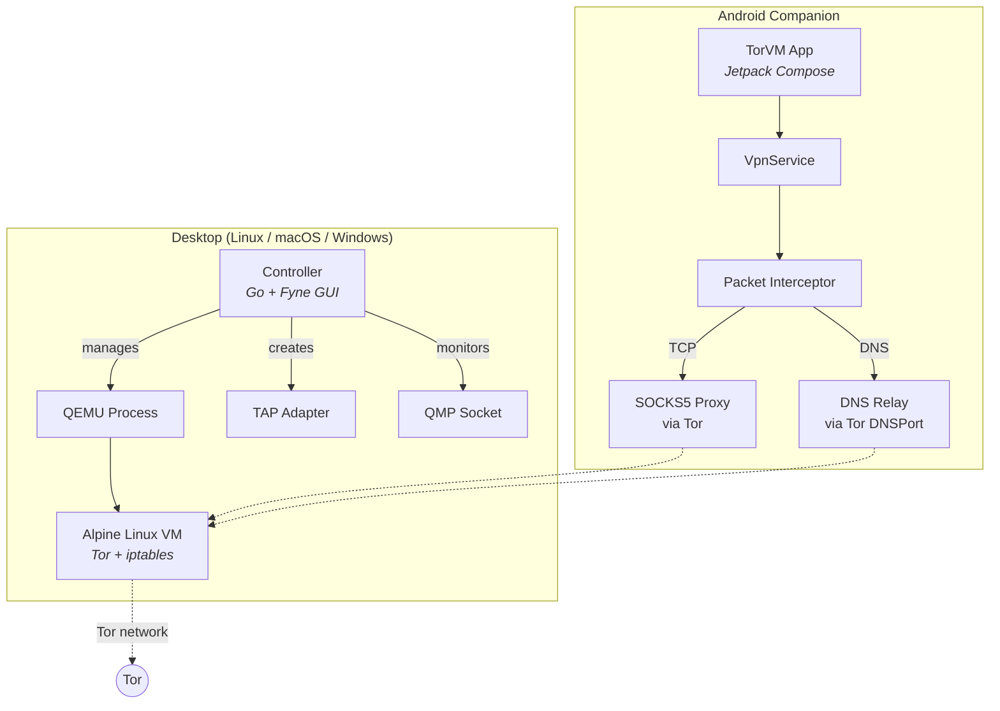
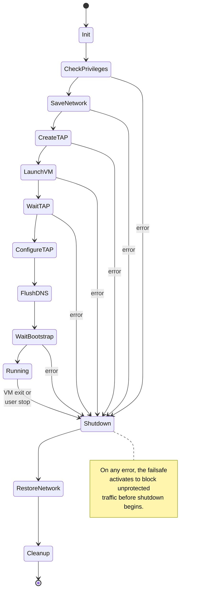
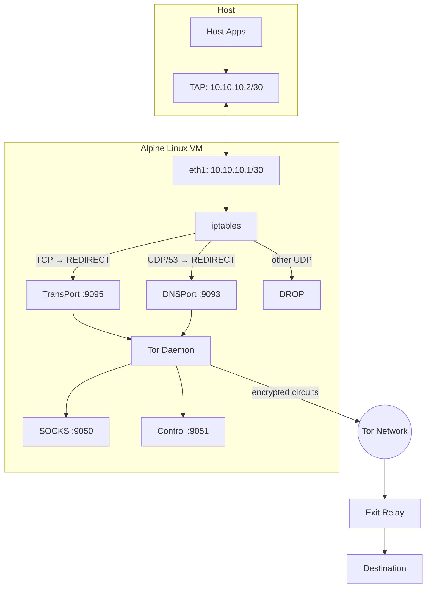
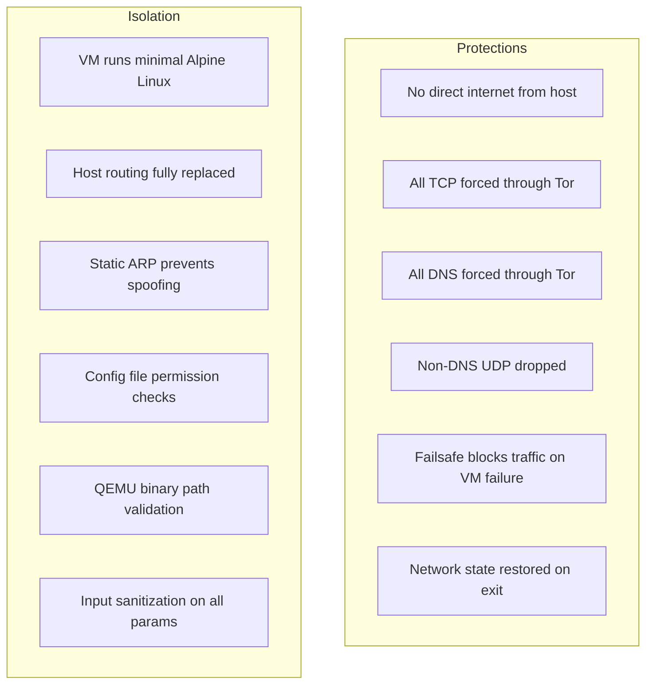

# TorVM - Transparent Tor Proxy Virtual Machine

TorVM routes **all host network traffic** through the Tor network transparently using a lightweight Alpine Linux VM running inside QEMU. No application configuration is needed -- every TCP connection and DNS query from the host is automatically redirected through Tor.

An optional Android companion app extends this protection to mobile devices by creating a local VPN that tunnels all traffic through a TorVM instance on the network.

**WARNING**: This is experimental software. Do NOT rely on it for privacy-sensitive purposes without thorough review.

## How It Works



The host has **no direct internet access**. The controller replaces the host's default route with the TAP adapter, forcing all traffic into the VM. Inside the VM, iptables rules redirect TCP to Tor's transparent proxy and DNS to Tor's resolver. All other traffic is dropped.

## Components



### Controller (Desktop)

A cross-platform Go application that manages the entire VM lifecycle. Provides both a graphical interface (Fyne v2.5.4) and a headless mode for server/service deployments.

**Features:**
- Automatic TAP adapter creation and host route manipulation
- QEMU process management with QMP for graceful shutdown
- Hardware acceleration detection (KVM, HVF, WHPX, TCG fallback)
- Pluggable transport support (obfs4, meek-azure, snowflake)
- Upstream proxy support (HTTP, HTTPS, SOCKS5)
- Failsafe: blocks all traffic if the VM dies unexpectedly
- Network state save/restore to cleanly undo routing changes
- Persistent state disk (64 MB ext4) for Tor data across restarts
- GUI with tabs: Status, Bridges, Proxy, Settings, Logs
- System service integration (systemd, launchd, Windows service)

### VM Image (Alpine Linux)

A minimal Linux kernel + initramfs built via multistage Docker build. Runs as PID 1 inside QEMU with a single purpose: transparent Tor proxying.

**Features:**
- iptables rules redirect all TCP through Tor's TransPort
- DNS queries intercepted and resolved via Tor's DNSPort
- Non-DNS UDP dropped (Tor does not support generic UDP)
- Static ARP entries prevent ARP spoofing on the /30 link
- Persistent Tor data directory on virtio state disk
- Pluggable transport binaries (obfs4proxy, snowflake-client)
- Entropy seeding from host via virtio-rng + kernel params

### Android Companion App

A standalone Android VPN app (Jetpack Compose + Material 3) that creates a local VPN to route device traffic through a TorVM instance.

**Features:**
- Full device VPN via Android's VpnService API
- Userspace TCP/IP stack with per-connection SOCKS5 proxying
- DNS relay through Tor's DNSPort
- IPv6 black-holed to prevent leaks
- Configurable SOCKS and DNS endpoints

## Lifecycle State Machine

The controller drives a deterministic state machine that ensures the host network is always left in a clean state, even on failure.



## Network Topology



| Interface | Address | Purpose |
|---|---|---|
| Host TAP | 10.10.10.2/30 | Host endpoint |
| VM eth1 | 10.10.10.1/30 | Gateway / proxy |
| Tor TransPort | :9095 | Transparent TCP proxy |
| Tor DNSPort | :9093 | DNS resolution via Tor |
| Tor SOCKSPort | :9050 | SOCKS5 proxy |
| Tor ControlPort | :9051 | Tor control protocol |

## Security Model



- **Network isolation** -- The host's default route is replaced with the TAP adapter. There is no path to the internet that bypasses the VM.
- **Failsafe** -- If the VM crashes or QEMU exits unexpectedly, the failsafe activates immediately to block all traffic, preventing unprotected leaks.
- **Clean shutdown** -- The lifecycle state machine saves the host's network configuration before modifying it and restores it during shutdown, even after errors.
- **Input validation** -- All kernel command-line parameters, torrc directives, TAP names, file paths, and proxy credentials are validated against strict whitelists.
- **Privilege minimization** -- Root is required only for TAP adapter creation. The VM runs Tor as an unprivileged user.

## Prerequisites

- **Docker** -- Required to build the VM image (multistage build)
- **Go 1.22+** -- Required to build the controller
- **QEMU 8.0+** -- Required at runtime to run the VM

## Building

```bash
# Build everything (VM image + controller binaries)
make

# Build only the VM image
make vm

# Build only the controller (cross-compiled for all platforms)
make controller

# Build only for the current platform (development)
cd controller && go build -o ../dist/controller/torvm ./cmd/torvm/

# Install to /usr/local (Linux/macOS)
sudo make install

# Clean build artifacts
make clean
```

The VM build uses Docker to produce `dist/vm/vmlinuz`, `dist/vm/initramfs.gz`, and `dist/vm/state.img`.

The controller cross-compiles for: linux/amd64, linux/arm64, darwin/amd64, darwin/arm64, windows/amd64. Binaries are placed in `dist/controller/`.

## Usage

### Linux

```bash
# Run with GUI
sudo torvm

# Run headless (no UI)
sudo torvm --headless

# Use specific acceleration
sudo torvm --accel kvm

# Custom configuration
sudo torvm --config config.json

# Debug logging
sudo torvm --verbose

# Install as systemd service
sudo cp installer/linux/torvm.service /etc/systemd/system/
sudo systemctl enable --now torvm
```

### macOS

```bash
# Run with GUI
sudo torvm

# Uses HVF acceleration automatically
sudo torvm --accel hvf

# Install as launchd service
sudo cp installer/macos/torvm.plist /Library/LaunchDaemons/org.torproject.torvm.plist
sudo launchctl load /Library/LaunchDaemons/org.torproject.torvm.plist
```

### Windows

```powershell
# Run with GUI (requires Administrator)
torvm.exe

# Uses WHPX acceleration when available
torvm.exe --accel whpx

# Or install via MSI (built from installer/windows/torvm.wxs)
```

### Android

Build and install the companion app:

```bash
cd android
./gradlew assembleDebug
adb install app/build/outputs/apk/debug/app-debug.apk
```

Configure the app to point at your TorVM instance's IP and ports, then tap Connect.

## Directory Structure

```
extorvm/
  controller/           Go controller application
    cmd/torvm/            Entry point (flag parsing, config, main loop)
    internal/
      config/             JSON config with platform-aware defaults
      lifecycle/          State machine engine + failsafe
      network/            Platform-specific TAP/routing (Linux, macOS, Windows)
      vm/                 QEMU process management, QMP client, state disk
      platform/           Hardware acceleration detection
      logging/            Thread-safe logger with ring buffer
      security/           Entropy collection
      launchd/            macOS service management
    gui/                  Fyne GUI (status, bridges, proxy, settings, logs)
  vm/
    alpine/               VM init script, torrc, iptables router, entropy
    scripts/              Docker build helpers
  android/
    app/src/main/kotlin/  Kotlin source (VPN, TCP stack, DNS relay, SOCKS5)
    app/src/main/res/     Android resources and layouts
  installer/
    linux/                systemd service unit
    macos/                launchd plist
    windows/              WiX MSI installer
  scripts/                Build scripts
  dist/                   Build output (generated)
  legacy/                 Original 2008-2009 codebase (historical reference)
  doc/                    Documentation
```

## Legacy Code

The `legacy/` directory contains the original 2008-2009 TorVM codebase from The Tor Project, Inc., preserved for historical reference. It targeted Windows with OpenWRT and a C controller. The modern version replaces this with Alpine Linux, a Go controller, and cross-platform support.

## License

See the [LICENSE](LICENSE) file for rights and terms.

Software Copyright (C) 2008-2009 The Tor Project, Inc.
